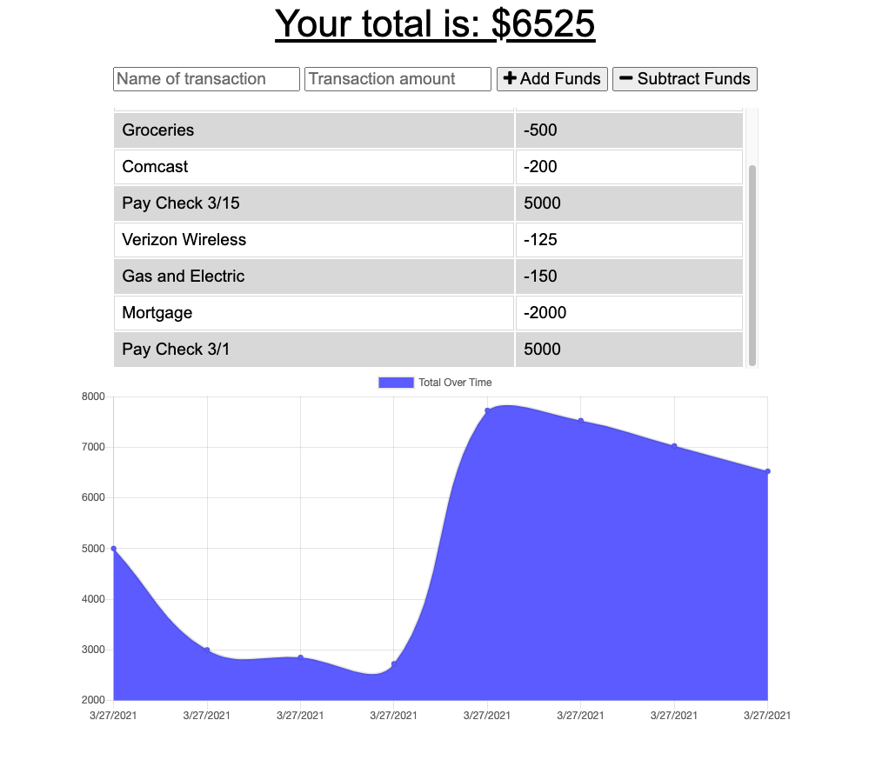

# Budget Tracker   

## Description   
This application allows you to track personal transactions and help you to plan a budget. The data will be entered offline and will be cached and uploaded when you establish a connection.   

***
### Table of Contents  
1. [Screenshot](https://github.com/MLLynch2K/budget-tracker#screenshot)
2. [Deployed Link](https://github.com/MLLynch2K/budget-tracker#deployed-link)
3. [Features](https://github.com/MLLynch2K/budget-tracker#features)
4. [Contributors](https://github.com/MLLynch2K/budget-tracker#contributors)
5. [Questions](https://github.com/MLLynch2K/budget-tracker#questions)   

***   
### Screenshot   
    

***
### Deployed Link     
  

***
### Features  
HTML   
CSS   
Bootstrap   
JavaScript  
Node.js   
Express.js     
Mongoose   
Compression   
Lite-Server   
Morgan   

***
### Contributors  
Michele Lee Lynch

***
### Questions  
[Contact Me](https://github.com/MLLynch2K)   